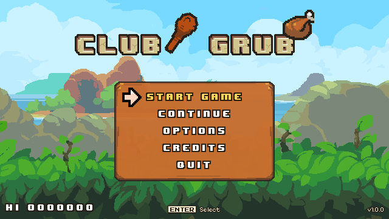
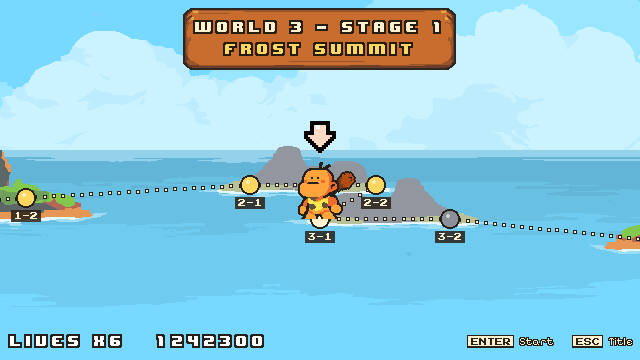
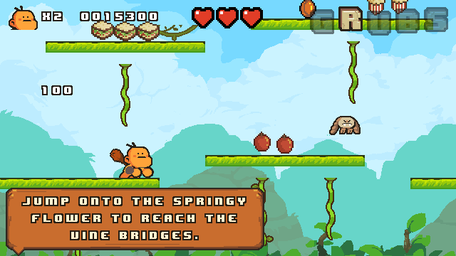
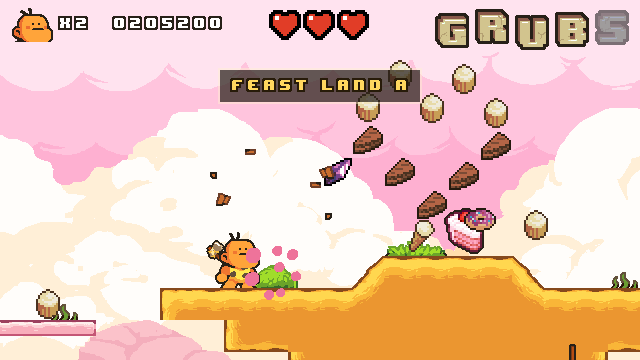
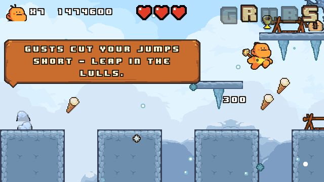
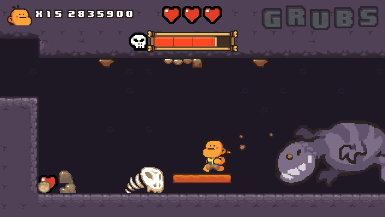

# Club & Grub

A hungry caveman clubs his way through jungles, caves, ice fields and a volcano: he bounces on heads, knocks
hidden food out of the scenery, spells G-R-U-B-S for a jackpot and eats everything that is not nailed down.

Club & Grub is an original 2D platformer that reproduces the *gameplay and physics* of Prehistorik 2 (Titus, 1993)
tick for tick - the same 24.3 Hz simulation, momentum, jumps, club strikes, hidden spots, bosses and stage flow -
with entirely original levels, code and freely licensed (CC0 / OFL) art and audio.

| | |
|---|---|
|  |  |
|  |  |
|  |  |

> **An homage, not a copy.** Club & Grub is not affiliated with, endorsed by or connected to Titus Interactive or
> the owners of Prehistorik. It contains no graphics, audio, level data or code of that game or of any other
> commercial game. All third-party material is listed in [CREDITS.md](CREDITS.md).

## Features

- **Faithful feel**: the hero's weight, skids, jumps, head bounces and strike timing follow a frame-exact
  specification of the original (`docs/spec/PHYSICS.md`), verified against reference traces by the test suite.
- **15 stages**: four worlds of two stages, two bosses (the Brute and the Wall Colossus), three Feast Land bonus
  stages behind hidden warps, and the way home. Beginner plays worlds 1-3 and ends at the expert wall; Expert adds
  the volcano, the Colossus and the ending.
- **Hidden everything**: odd ground, rocks, bushes and walls hide food, treasures, hearts and giant bonuses; the
  letters G-R-U-B-S drop a 100 000-point jackpot; secret rooms behind gates and cracked walls.
- **Four weapons** a run keeps from stage to stage: the club, the hammer, the thrown axe and the swirling axe.
  Crouch to charge your next blow (four times the damage) - the hero glows while it lasts.
- **Glider, wind, ice, darkness, an auto-scrolling lava shaft**, rising columns, drop floes and springs.
- **Progress**: checkpoints, a level code for every stage, saved progress and high score per mode, a level select
  of the stages reached.
- **Any screen**: the 640 x 360 picture is scaled by whole numbers; wider or taller screens show more of the level,
  never black bars. Keyboard, gamepad and touch, every action rebindable.
- **Proven playable**: every stage has recorded input routes for every weapon a player can bring into it, replayed
  tick for tick by the test suite; both campaigns are played from start to end on every change.

## Controls

| Action | Keyboard | Gamepad | Touch |
|---|---|---|---|
| Walk | Left / Right, A / D | D-pad, left stick | on-screen pad |
| Jump (hold it as you land on a head to bounce high) | Z, K (Up / W too while "Up jumps" is on) | A | jump button |
| Strike (hold Up for a high strike, Down for a low one) | Space, X, J | X, B | club button |
| Crouch (charges the next blow), enter a gate, drop through a hatch | Down, S | D-pad down, stick down | on-screen pad |
| Look ahead | C, L, keypad 5 | Y, RB | look button |
| Pause | Escape, P | Start | pause button |
| Menus | arrows, Enter / Space, Escape | D-pad, A, B | tap |
| Fullscreen (desktop) | Alt+Enter, F11 | - | - |

Keys are bound by their position, so the layout works on every keyboard; Options rebinds every game action for
keyboard and gamepad. The game pauses by itself when its window loses focus.

## The stages

| Stage | Name | What happens there |
|---|---|---|
| 1-1 | Vine Bridges | jungle tutorial: the club, hidden spots, head bounces, vine bridges over a lake, a canopy road home |
| 1-2 | Canopy Village | a tall tree village: the axe, danglers, lifts, a trunk room; a bat bounce up to the warp to Feast Land A |
| 2-1 | Echo Caverns | hatches between cave chambers, darkness, swinging bats, gates to secret rooms, the hammer, the warp to Feast Land B |
| 2-2 | Bone Gorge, Brute's Den | rising stepping stones, a lift pillar, the hang-glider over the gorge, then boss 1: the Brute |
| 3-1 | Frost Summit, Blizzard Pass | slippery snow on ice, a frozen lake, a cliff climb, chargers; then the gusts of a blizzard (crouch to brace) |
| 3-2 | Crystal Grotto | drop floes over icy water, leapers, the swirling axe, the warp to Feast Land C - the last Beginner stage |
| 4-1 | Cinder Shaft | Expert: an auto-scrolling descent through lava strata and ember rain |
| 4-2 | Obsidian Keep, Colossus Hall | Expert: a fortress of rising columns and spikes, then boss 2: the Wall Colossus |
| - | Feast Land A, B, C | bonus stages full of food behind the warps of 1-2, 2-1 and 3-2 |
| - | Way Home | the epilogue after the Colossus: the walk home to the village, then The End |

## Running from source

The engine is not part of this repository.

1. Download **Godot 4.7.2 stable, standard build** (not .NET) from
   [godotengine.org](https://godotengine.org/download/archive/4.7.2-stable/) or the
   [GitHub release](https://github.com/godotengine/godot/releases/tag/4.7.2-stable).
2. Either open the project folder in the Godot editor and press F5, or from a terminal in the project folder:

   ```
   godot --headless --path . --import    # once: builds Godot's import cache
   godot --path .                        # play
   ```

The development scripts expect the console binary in `.tools/godot/` (on Windows
`.tools/godot/Godot_v4.7.2-stable_win64_console.exe`), or the path in the `GODOT` environment variable;
`bash .tools/gd.sh` explains what to download when it cannot find it. User data (settings, save game) lives in
`%APPDATA%/ClubAndGrub/` on Windows, `~/Library/Application Support/ClubAndGrub/` on macOS and in the app sandbox on
phones.

## Tests and development tools

Run from the project root with Git Bash (or any POSIX shell). `.tools/gd.sh` wraps Godot so that several tools can
share the folder; the plain Godot command is in brackets.

| What | Command |
|---|---|
| Import (after a checkout or a new `class_name`) | `bash .tools/gd.sh import` (`godot --headless --path . --import`) |
| All tests (nearly 600, two to three minutes) | `bash .tools/gd.sh test` (`godot --headless --path . -s res://tests/run_tests.gd`) |
| One module / one test | `bash .tools/gd.sh test player --verbose`, `bash .tools/gd.sh test campaign --only=world_2` |
| Every route proof (all weapons) and both campaigns, headless | `bash .tools/gd.sh test campaign_routes` |
| Boot check | `bash .tools/gd.sh smoke 3` (`godot --headless --path . -- --smoke=3`; exit code 0 = clean log) |
| Watch a route | `bash .tools/gd.sh play --autoplay=w2_l2b --difficulty=expert --weapon=axe --inputs-file=tools/autoplay/routes/w2_l2b.expert.axe.inputs --fast` |
| The whole Expert campaign, played and checked | `GD_TIMEOUT=1800 bash .tools/gd.sh play --flow=tools/autoplay/campaign.flow --fast --fresh-user` |
| Check level files | `bash .tools/gd.sh script res://tools/validate_levels.gd -- --strict` |
| Render a whole level | `bash .tools/gd.sh script res://tools/world_render_level.gd -- w1_l1 --collision` |

Screenshots of harness runs land in `build/screenshots/<name>/`. How to build a level is in
[docs/LEVEL_DESIGN.md](docs/LEVEL_DESIGN.md); the architecture, module ownership and every API are in
[docs/ARCHITECTURE.md](docs/ARCHITECTURE.md); the gameplay and physics specifications are in `docs/spec/`.

## Building a release

Windows (one self-contained `.exe`, plus the licence texts in the release zip):

```
powershell -ExecutionPolicy Bypass -File tools\build_windows.ps1
```

The script checks Godot and the export templates, imports the project, runs the whole test suite, exports
`build/windows/ClubAndGrub.exe`, starts it for a smoke check, puts the licence texts into `build/windows/licenses/`
and packs `build/ClubAndGrub-<version>-windows.zip`; it stops with exit code 1 at the first problem. Every
platform, the export templates and the signing placeholders: [docs/BUILD.md](docs/BUILD.md). Android, iOS and
macOS status: [docs/PORTING.md](docs/PORTING.md).

## Project structure

| Path | Content |
|---|---|
| `scripts/`, `scenes/` | game code and scenes: `core` (autoloads, simulation clock, flow, input, audio, save), `base` (the contract classes), `player`, `enemies`, `bosses`, `projectiles`, `objects`, `items`, `fx`, `world`, `zones`, `ui` |
| `levels/` | level files (plain text, format in ARCHITECTURE.md section 7): `w<world>_l<stage>[b].lvl`, `bonus_*.lvl`, `ending.lvl`; `test_*.lvl` are developer levels (not exported) |
| `assets/` | art, fonts and audio (all third-party, licences in `assets/licenses/`) |
| `locale/` | the English texts (`en.po`) |
| `tests/` | the headless test suite (`run_tests.gd` runs every `test_*.gd`) |
| `tools/` | build script, level tools, autoplay flows and route proofs (`tools/autoplay/`) - not exported |
| `docs/` | architecture, specifications, level design, build, porting and third-party notes (not exported) |
| `build/` | scratch output: exports, screenshots, test user data (ignored by Godot and git) |

## Credits and licence

Art, sound and music are CC0 packs by Pixel-boy / Sparklin Labs, ARoachIFoundOnMyPillow, ghostpixxells, Pixel Frog,
ansimuz, Juhani Junkala, MintoDog, Wolfgang_ and others; the fonts Press Start 2P and Pixelify Sans are under the
SIL Open Font License; made with [Godot Engine](https://godotengine.org) (MIT). The full list with sources and
changes is in [CREDITS.md](CREDITS.md), the licence texts are in `assets/licenses/` (and readable in the game under
Credits > Licences), and [docs/THIRD_PARTY.md](docs/THIRD_PARTY.md) lists every obligation and how it is met.

The game's own code, levels and documentation: all rights reserved, see [LICENSE](LICENSE).
